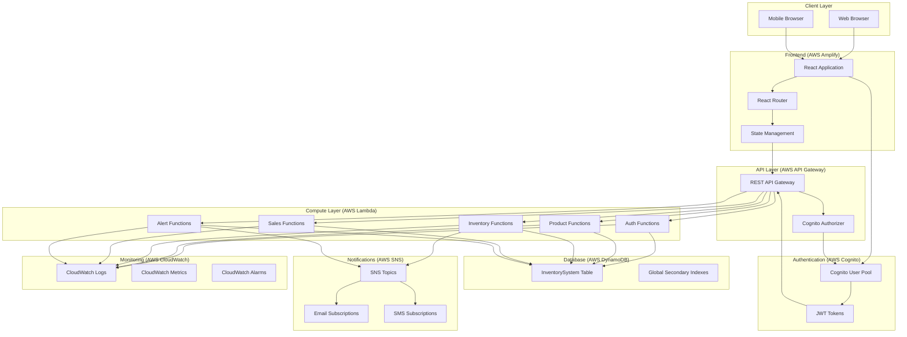
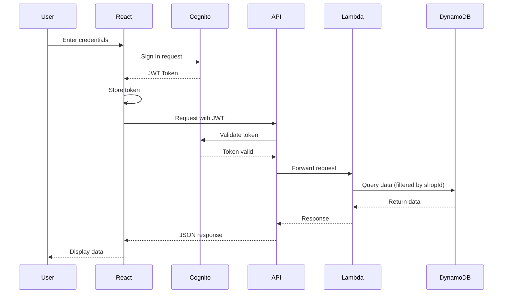
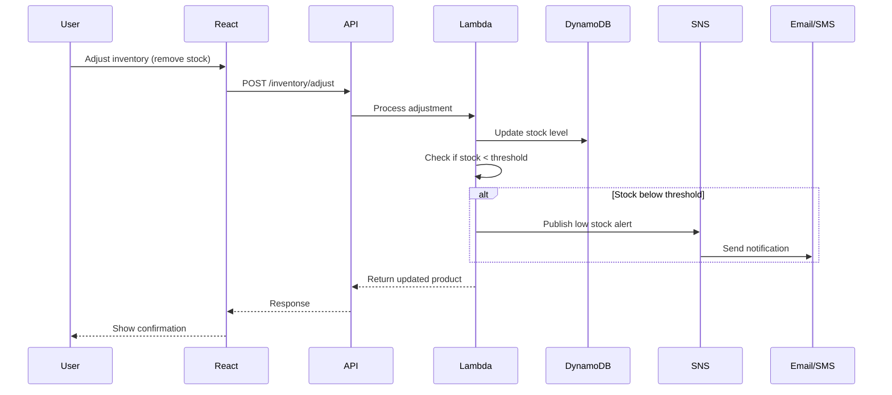

# Architecture Documentation

## System Architecture Diagram



## Data Flow

### Authentication Flow



### Low Stock Alert Flow



## Component Architecture

```
src/
├── components/
│   ├── layout/           # Layout components
│   │   ├── AppSidebar    # Navigation sidebar
│   │   ├── TopBar        # Header with user menu
│   │   └── DashboardLayout # Protected route wrapper
│   ├── dashboard/        # Dashboard-specific components
│   │   ├── StatCard      # Metric display cards
│   │   ├── LowStockTable # Alert table
│   │   └── RecentSalesCard # Sales summary
│   └── ui/               # Shadcn/UI components
├── contexts/
│   └── AuthContext       # Authentication state
├── services/             # API service layer
│   ├── api.ts            # Base API client
│   ├── authService.ts    # Cognito integration
│   ├── productService.ts # Product CRUD
│   ├── inventoryService.ts # Stock management
│   ├── salesService.ts   # Sales operations
│   └── alertService.ts   # SNS notifications
├── types/
│   └── inventory.ts      # TypeScript interfaces
├── config/
│   └── api.ts            # AWS configuration
├── data/
│   └── mockData.ts       # Development mock data
└── pages/                # Route components
```

## Security Architecture

1. **Authentication**: AWS Cognito handles all user authentication
2. **Authorization**: API Gateway validates JWT tokens before forwarding requests
3. **Multi-tenancy**: All Lambda functions filter data by `shopId` from the JWT claims
4. **Data isolation**: DynamoDB access patterns ensure shops can only access their own data
5. **Transport**: All communication uses HTTPS

## Scalability Considerations

- **Serverless**: Lambda auto-scales based on demand
- **DynamoDB**: On-demand capacity mode handles traffic spikes
- **API Gateway**: Handles millions of requests per second
- **SNS**: Highly available messaging system
