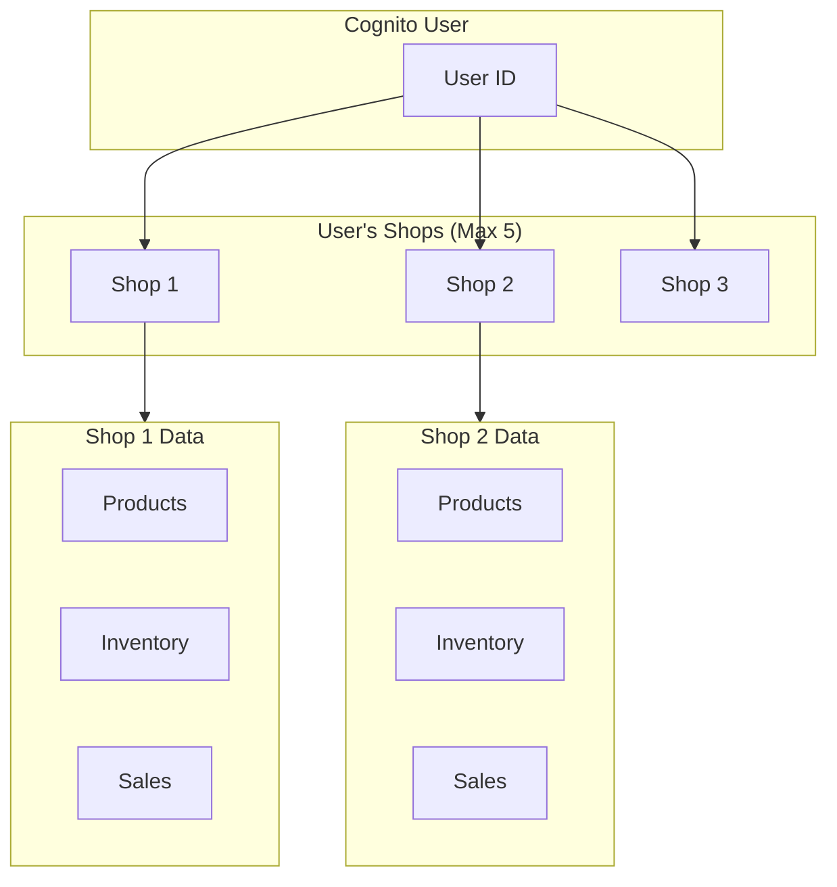
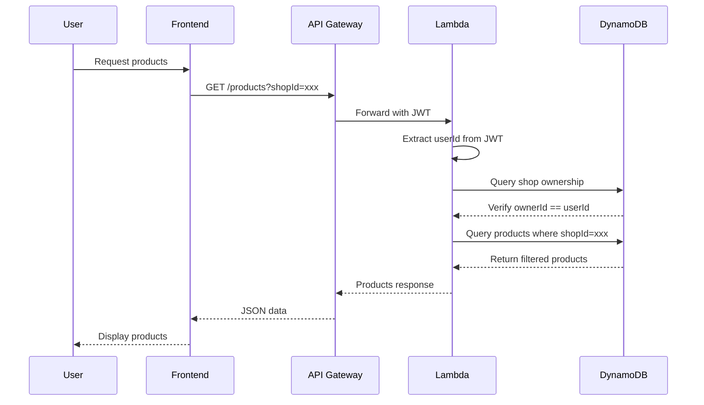
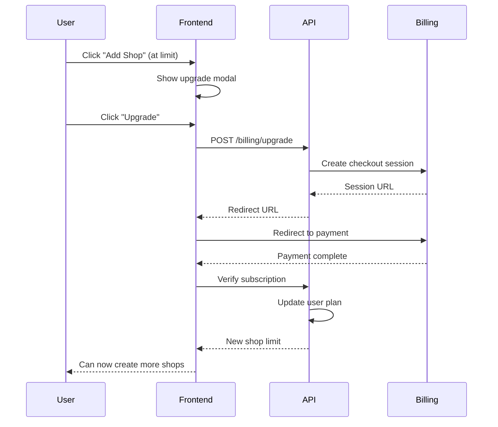

# Multi-Shop Architecture Documentation

## Overview

The StockFlow system supports a multi-shop architecture where a single user (Cognito user) can create and manage multiple shops, with configurable limits per plan.

## Architecture Diagram



## Data Model

### Shop Entity

```typescript
interface Shop {
  id: string;           // Unique shop identifier
  name: string;         // Shop display name
  ownerId: string;      // Cognito User ID (foreign key)
  address?: string;     // Physical address
  phone?: string;       // Contact phone
  email?: string;       // Contact email
  planType?: string;    // 'free' | 'pro' | 'enterprise'
  createdAt: string;    // ISO timestamp
  updatedAt: string;    // ISO timestamp
}
```

### Shop Limits by Plan

| Plan | Shop Limit | Features |
|------|------------|----------|
| Free | 5 | Basic features |
| Pro | 20 | Advanced analytics |
| Enterprise | Unlimited | Custom integrations |

## Data Isolation

### Principle

Each shop's data is completely isolated. Products, inventory transactions, and sales records are partitioned by `shopId`.

### Access Control Flow



### Validation Rules

1. **Shop Ownership**: Every API request must verify that the requesting user owns the target shop
2. **Shop ID Required**: All product/inventory/sales APIs require `shopId` parameter
3. **Cross-Shop Prevention**: Users cannot access data from shops they don't own

## Frontend Implementation

### ShopContext

The `ShopContext` provides global state management for multi-shop functionality:

```typescript
interface ShopContextType {
  shops: Shop[];              // List of user's shops
  selectedShop: Shop | null;  // Currently active shop
  shopLimit: number;          // Max shops allowed (default: 5)
  isLoading: boolean;
  setSelectedShop: (shop: Shop) => void;
  createShop: (data: CreateShopData) => Promise<Result>;
  updateShop: (shopId: string, data: Partial<Shop>) => Promise<Result>;
  deleteShop: (shopId: string) => Promise<Result>;
  canCreateShop: boolean;     // shopCount < shopLimit
  remainingShops: number;     // shopLimit - shopCount
}
```

### Shop Selection Persistence

- Selected shop ID stored in `localStorage` as `selectedShopId`
- On page refresh, previously selected shop is restored
- If selected shop no longer exists, falls back to first shop

### UI Components

1. **ShopSelector**: Dropdown in top navigation bar
   - Shows current shop name
   - Lists all user shops
   - Allows quick switching
   - "+ Add Shop" button

2. **Shops Page**: Full shop management
   - Grid view of all shops
   - Create/Edit/Delete functionality
   - Visual quota indicator

## Backend Implementation (AWS)

### Lambda: createShopHandler

```javascript
exports.handler = async (event) => {
  const userId = event.requestContext.authorizer.claims.sub;
  
  // Count existing shops
  const params = {
    TableName: 'InventorySystem',
    KeyConditionExpression: 'PK = :pk AND begins_with(SK, :sk)',
    ExpressionAttributeValues: {
      ':pk': `USER#${userId}`,
      ':sk': 'SHOP#'
    }
  };
  
  const result = await dynamodb.query(params).promise();
  
  if (result.Items.length >= 5) {
    return {
      statusCode: 400,
      body: JSON.stringify({ error: 'SHOP_LIMIT_REACHED' })
    };
  }
  
  // Create new shop...
};
```

### Access Control in All Lambdas

```javascript
// Validate shop ownership
const validateShopOwnership = async (userId, shopId) => {
  const params = {
    TableName: 'InventorySystem',
    Key: {
      PK: `USER#${userId}`,
      SK: `SHOP#${shopId}`
    }
  };
  
  const result = await dynamodb.get(params).promise();
  return !!result.Item;
};

// In every handler
const userId = event.requestContext.authorizer.claims.sub;
const shopId = event.queryStringParameters?.shopId;

if (!await validateShopOwnership(userId, shopId)) {
  return {
    statusCode: 403,
    body: JSON.stringify({ error: 'Access denied' })
  };
}
```

## API Endpoints

### Shop Management

| Method | Endpoint | Description |
|--------|----------|-------------|
| GET | /shops | List all shops for user |
| POST | /shops | Create new shop |
| GET | /shops/{shopId} | Get shop details |
| PUT | /shops/{shopId} | Update shop |
| DELETE | /shops/{shopId} | Delete shop |

### Shop-Aware Endpoints

All data endpoints require `shopId`:

```
GET /products?shopId={shopId}
POST /products (body includes shopId)
PUT /products/{id}?shopId={shopId}
DELETE /products/{id}?shopId={shopId}

GET /inventory?shopId={shopId}
POST /inventory/adjust?shopId={shopId}

GET /sales?shopId={shopId}
POST /sales?shopId={shopId}
```

## DynamoDB Schema Updates

### Shops Table Structure

```
PK: USER#<userId>
SK: SHOP#<shopId>
Attributes:
  - shopId
  - shopName
  - ownerId
  - address
  - phone
  - email
  - planType
  - shopLimit (default: 5)
  - createdAt
  - updatedAt
```

### Products (shop-scoped)

```
PK: SHOP#<shopId>
SK: PRODUCT#<productId>
```

### Inventory Transactions (shop-scoped)

```
PK: SHOP#<shopId>
SK: INV#<timestamp>#<transactionId>
```

### Sales (shop-scoped)

```
PK: SHOP#<shopId>
SK: SALE#<timestamp>#<saleId>
```

## Plan Upgrade Flow



## Security Considerations

1. **JWT Validation**: All shop operations require valid Cognito JWT
2. **Ownership Verification**: Every request verifies user owns the target shop
3. **Rate Limiting**: API Gateway throttles per-user requests
4. **Audit Logging**: All shop operations logged to CloudWatch

## Migration Guide

For existing single-shop implementations:

1. Create shops table entries for existing users
2. Add `shopId` to all existing products/inventory/sales
3. Update frontend to use ShopContext
4. Deploy updated Lambda functions
5. Test multi-shop flows thoroughly
